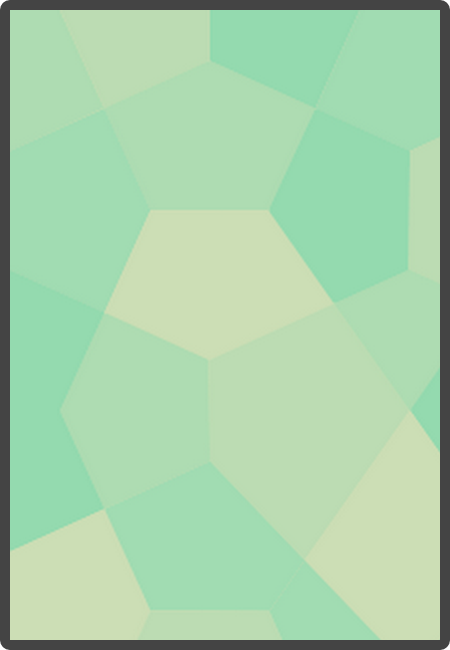

Cards
=====

[Cards][], for a card game.
(Warning: deceptively high-resolution images!)

Card images are placeholder art.
The rules are in another castle.

## Installation

* Clone the repo
* Have [Node.js][]
* Open a console in the project directory 
* `npm i`

## Import into [Tabletop Simulator]

Without installing, you can save [Card Game.json][] to `%USERPROFILE%\Documents\My Games\Tabletop Simulator\Saves\Chest\`

If installed, you can just `npm run export-to-tabletop-simulator`

In Tabletop Simulator, go to Host > Chest > Saved Objects and find Card Game.

## Update cards

* `npm run import` (following the steps the first time, with a Google account having access to the Google Docs)
* `npm run export`
* `npm run export-to-tabletop-simulator`

You can `set PARALLEL_EXPORT=ON` before running `export` to speed it up significantly if it's on a powerful enough machine. (If it's not powerful enough it might freeze up the entire computer.)

The credentials for importing may eventually expire, in which case they must be deleted manually before importing again. (`%USERPROFILE%\.credentials\nodejs-drive-access.json`)

[Cards]: http://1j01.github.io/cards/
[Card Game.json]: https://raw.githubusercontent.com/1j01/cards/gh-pages/data/export/Card%20Game.json
[Node.js]: https://nodejs.org/en/
[Tabletop Simulator]: http://store.steampowered.com/app/286160/
